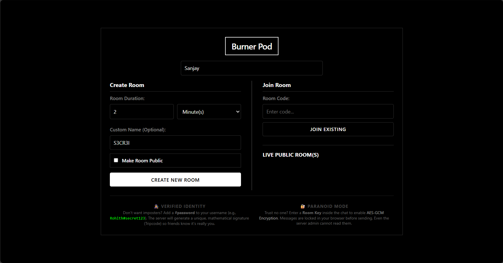
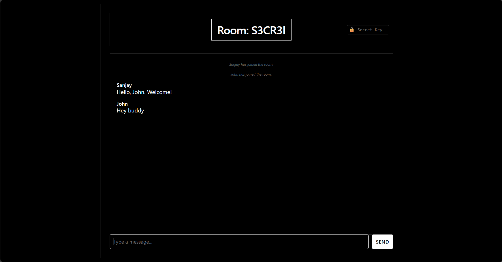

<div align="center">

# Burner Pod

**Ephemeral chat rooms that self-destruct. No accounts. No storage.**

[](https://opensource.org/licenses/MIT)
[](https://github.com/deakR/burner-pod/issues)
[](https://github.com/deakR/burner-pod/commits/main)
<br>
[](https://golang.org/dl/)
[](https://www.docker.com/)
[](https://github.com/deakR/burner-pod/stargazers)
[](https://github.com/deakR/burner-pod/forks)

Burner Pod is a minimalist, real-time chat application built with Go and WebSockets. Create temporary chat rooms with custom expiration times, join public rooms, or keep conversations private. Messages disappear when the room expires, perfect for quick collaborations, temporary support channels, or just chatting without leaving a trace.

</div>

## Table of Contents

- [Burner Pod](#burner-pod)
  - [Table of Contents](#table-of-contents)
  - [Overview](#overview)
  - [Key Features](#key-features)
  - [Previews](#previews)
  - [Getting Started](#getting-started)
    - [Quick Start](#quick-start)
    - [Docker Deployment](#docker-deployment)
  - [Usage](#usage)
    - [Creating a Room](#creating-a-room)
    - [Joining a Room](#joining-a-room)
    - [Tripcode Authentication](#tripcode-authentication)
    - [End-to-End Encryption](#end-to-end-encryption)
  - [Architecture](#architecture)
  - [Project Structure](#project-structure)
  - [API Reference](#api-reference)
  - [Security](#security)
  - [Detailed Documentation](#detailed-documentation)
  - [Contributing](#contributing)
  - [License](#license)
  - [Acknowledgements](#acknowledgements)

## Overview

Burner Pod provides temporary conversations without permanence. No accounts, no data collection, no message history, just instant, ephemeral chat rooms built with Go, WebSockets, and client-side encryption. All data exists only in memory; when a room expires, everything is gone.

**What's the need for this?**
- Quick, temporary communication without leaving a trace
- Instant chat rooms that automatically expire
- Perfect for quick collaborations, temporary support channels, or private conversations
- No permanent storage of sensitive information

**How does this work?**
- Uses **WebSockets** for real-time bidirectional communication between clients and the Go server
- Creates a Chat Room abstraction with automatic expiration
- Multiple users communicate until the room self-destructs
- Join existing rooms with a room code or create a new one with customizable duration

**🏠 Self-Hosted Solution**

Burner Pod is designed to be **self-hosted**. There is no public instance or hosted service—you run it on your own server, VPS, or local machine. This ensures:
- **Complete privacy:** Your data never touches third-party servers
- **Full control:** Customize, modify, or restrict access as needed
- **Easy deployment:** One Docker command or simple Go binary to get started

Whether you deploy it on a Raspberry Pi at home, a $5/month VPS, or your local network, you maintain complete ownership of your conversations.

<p align="right">(<a href="#burner-pod">back to top</a>)</p>

## Key Features

- **🚀 Real-time Messaging:** Instant WebSocket-based communication with zero latency
- **⏱️ Auto-Expiring Rooms:** Set custom time-to-live (seconds to days) for automatic room deletion
- **🔐 End-to-End Encryption:** Optional AES-GCM 256-bit encryption using room keys (browser side)
- **🎭 Tripcode Authentication:** Cryptographically verified identities without password storage
- **🌐 Public/Private Rooms:** Choose visibility with live public room discovery
- **📝 Markdown Support:** Rich text formatting in messages with DOMPurify sanitization
- **💨 Zero Persistence:** Pure in-memory storage, no databases, no message logs
- **🐳 Docker Ready:** Single-command deployment with multi-stage builds (~10MB image)
- **📱 Mobile Responsive:** Clean, minimal UI that works on any device
- **🔒 XSS Protection:** HTML sanitization and secure WebSocket connections

<p align="right">(<a href="#burner-pod">back to top</a>)</p>

## Previews


_Room creation and public room discovery._


_Main chat interface with active room and encryption enabled._


<p align="right">(<a href="#burner-pod">back to top</a>)</p>

## Getting Started

### Quick Start

1. **Prerequisites:**
   - [Go 1.25+](https://golang.org/dl/) installed
   - (Optional) [Air](https://github.com/cosmtrek/air) for hot-reload development

2. **Clone the repository:**
   ```bash
   git clone https://github.com/deakR/burner-pod.git
   cd burner-pod
   ```

3. **Install dependencies:**
   ```bash
   go mod download
   ```

4. **Run the application:**
   ```bash
   # Standard run
   go run cmd/web/main.go

   # OR with hot-reload (recommended for development)
   air
   ```

5. **Open your browser:**
   - Navigate to **http://localhost:8080**
   - Create a room or join an existing one

<p align="right">(<a href="#burner-pod">back to top</a>)</p>

### Docker Deployment

**Option 1: Pull Pre-built Image (Recommended)**

No need to build! Pull the official image from Docker Hub:

```bash
# Pull the image
docker pull deakr/burner-pod:v0.1

# Run the container
docker run -d -p 8080:8080 --name burner-app deakr/burner-pod:v0.1
```

**Option 2: Build from Source**

1. **Build the Docker image:**
   ```bash
   docker build -t burner-pod .
   ```

2. **Run the container:**
   ```bash
   # Basic run
   docker run -d -p 8080:8080 burner-pod

   # With custom port
   docker run -d -p 3000:8080 burner-pod

   # With restart policy
   docker run -d -p 8080:8080 --name burner --restart unless-stopped burner-pod
   ```

3. **Access the application:**
   - Open **http://localhost:8080** (or your custom port)

<p align="right">(<a href="#burner-pod">back to top</a>)</p>

## Usage

### Creating a Room

1. Enter a **display name** (or leave blank for "Anonymous")
2. Set **room duration** using the time picker:
   - Seconds (1+)
   - Minutes (default: 1)
   - Hours
   - Days
3. *(Optional)* Specify a **custom room name** (e.g., `friday-hangout`)
4. *(Optional)* Check **"Make Room Public"** to list it on the lobby
5. Click **"Create New Room"**

You'll be redirected to the chat interface with your room active.

<p align="right">(<a href="#burner-pod">back to top</a>)</p>

### Joining a Room

**Option 1: Manual Entry**
- Enter the **room code** in the "Join Room" field
- Click **"Join Existing"**

**Option 2: Public Room List**
- Browse the **"LIVE PUBLIC NODES"** section on the lobby
- Click any active room chip to join instantly

<p align="right">(<a href="#burner-pod">back to top</a>)</p>

### Tripcode Authentication

Want to prove you're really you without accounts? Use a tripcode:

```
Username: YourName#secretPassword
```

**What happens:**
- The server hashes your password with SHA-256
- A unique 8-character signature is generated (e.g., `!Ab12Cd34`)
- Your displayed name becomes: `YourName !Ab12Cd34`
- Only someone with your exact password can recreate this tripcode

**Security Note:** The password never leaves your browser and is not stored anywhere.

<p align="right">(<a href="#burner-pod">back to top</a>)</p>

### End-to-End Encryption

For maximum privacy:

1. **Set a room key:**
   - Click the 🔒 field at the top of the chat
   - Enter a shared secret (share this out-of-band via Signal, phone call, etc.)

2. **Send encrypted messages:**
   - All messages are encrypted in your browser using AES-GCM
   - The server only sees ciphertext (prefixed with `ENC::`)
   - Even the server admin cannot decrypt your messages

3. **Decryption:**
   - Recipients with the correct key see plain text
   - Wrong key shows: `🔒 Encrypted Message (Wrong Key)`

<p align="right">(<a href="#burner-pod">back to top</a>)</p>

## Architecture

```
┌─────────────────────────────────────────────────────────────┐
│                        BURNER POD                           │
│                                                             │
│  ┌─────────────┐         ┌──────────────────┐              │
│  │   Browser   │◄────────┤   Go Web Server  │              │
│  │  (Client)   │  HTTP   │   (Port 8080)    │              │
│  └─────────────┘         └──────────────────┘              │
│        │                           │                        │
│        │ WebSocket                 │                        │
│        ▼                           ▼                        │
│  ┌─────────────┐         ┌──────────────────┐              │
│  │ JavaScript  │         │ Hub (In-Memory)  │              │
│  │ - Markdown  │         │ - Room Registry  │              │
│  │ - AES-GCM   │         │ - Broadcast Chan │              │
│  └─────────────┘         └──────────────────┘              │
└─────────────────────────────────────────────────────────────┘
```

**Tech Stack:**
- **Backend:** Go 1.25+ with [Gorilla WebSocket](https://github.com/gorilla/websocket)
- **Frontend:** Vanilla JavaScript, [marked.js](https://marked.js.org/), [DOMPurify](https://github.com/cure53/DOMPurify)
- **Encryption:** Web Crypto API (PBKDF2 + AES-GCM)
- **Styling:** Pure CSS
- **Development:** [Air](https://github.com/cosmtrek/air) for hot-reload

<p align="right">(<a href="#burner-pod">back to top</a>)</p>

## Project Structure

```
burner-pod/
├── cmd/
│   └── web/
│       └── main.go              # Application entry point, HTTP routes
├── internal/
│   ├── handlers/
│   │   └── websocket.go         # WebSocket logic, Hub, broadcasting
│   └── utils/
│       └── random.go            # Secure room ID generation
├── ui/
│   ├── html/
│   │   ├── index.html           # Lobby page (room creation/join)
│   │   └── chat.html            # Chat interface
│   └── static/
│       └── css/
│           └── style.css        # Application styling
├── .air.toml                    # Hot-reload configuration
├── .gitignore                   # Git exclusions
├── Dockerfile                   # Multi-stage container build
├── go.mod                       # Go module dependencies
├── go.sum                       # Dependency checksums
└── LICENSE                      # MIT License
```

<p align="right">(<a href="#burner-pod">back to top</a>)</p>

## API Reference

| Endpoint | Method | Description |
|----------|--------|-------------|
| `/` | GET | Serves the lobby page ([index.html](ui/html/index.html)) |
| `/chat` | GET | Serves the chat interface ([chat.html](ui/html/chat.html)) |
| `/create` | GET | Creates a new room and redirects to `/chat` |
| `/api/rooms` | GET | Returns list of public rooms (JSON) |
| `/ws/{roomID}` | WebSocket | WebSocket endpoint for real-time chat |
| `/static/*` | GET | Serves static assets (CSS, etc.) |

**Create Room Query Parameters:**

| Parameter | Type | Required | Description |
|-----------|------|----------|-------------|
| `code` | string | No | Custom room name (auto-generated if omitted) |
| `ttl` | int | Yes | Room lifetime in seconds |
| `public` | bool | No | Show in public room list (default: false) |
| `user` | string | No | Display name (default: "Anonymous") |

**Example:**
```
GET /create?code=test-room&ttl=600&public=true&user=Alice
```

**WebSocket Message Format:**

Client → Server:
```json
{
  "username": "Alice !Ab12Cd34",
  "text": "Hello, world!"
}
```

Server → Client:
```json
{
  "username": "System",
  "text": "Alice !Ab12Cd34 has joined the room."
}
```

<p align="right">(<a href="#burner-pod">back to top</a>)</p>

## Security

| Feature | Implementation |
|---------|----------------|
| **Tripcode** | SHA-256 hash → Base64 encoding → First 8 characters |
| **Encryption** | AES-GCM 256-bit via Web Crypto API |
| **Key Derivation** | PBKDF2 (1000 iterations, SHA-256, fixed salt) |
| **XSS Protection** | DOMPurify HTML sanitization on all rendered content |
| **CORS** | Currently allows all origins (customize for production) |

**Important Security Notes:**
- Encryption happens **client-side**—the server never sees plaintext
- Tripcodes are **irreversible**—lost passwords cannot be recovered
- Room keys should be shared **out-of-band** (not via the chat itself)
- No message persistence means no forensic recovery

<p align="right">(<a href="#burner-pod">back to top</a>)</p>

## Detailed Documentation

For comprehensive information, please refer to:

- **[ GitHub Issues](https://github.com/deakR/burner-pod/issues)** - Report bugs or request features
- **[💬 GitHub Discussions](https://github.com/deakR/burner-pod/discussions)** - Ask questions or share ideas

<p align="right">(<a href="#burner-pod">back to top</a>)</p>

## Contributing

Contributions are highly encouraged and welcome! Whether it's reporting a bug, suggesting a feature, or submitting code changes, your help is appreciated.

**How to contribute:**

1. Fork the repository
2. Create a feature branch (`git checkout -b feature/amazing-feature`)
3. Commit your changes (`git commit -m 'Add amazing feature'`)
4. Push to the branch (`git push origin feature/amazing-feature`)
5. Open a Pull Request

You can also check the [issues page](https://github.com/deakR/burner-pod/issues) for existing ideas or problems.

<p align="right">(<a href="#burner-pod">back to top</a>)</p>

## License

This project is licensed under the **MIT License**.

See the [LICENSE](./LICENSE) file for full details.

<p align="right">(<a href="#burner-pod">back to top</a>)</p>

## Acknowledgements

Burner Pod is built with ❤️ and the help of these fantastic open-source projects:

- [Go](https://golang.org/) - The programming language
- [Gorilla WebSocket](https://github.com/gorilla/websocket) - WebSocket implementation
- [marked.js](https://marked.js.org/) - Markdown parser
- [DOMPurify](https://github.com/cure53/DOMPurify) - HTML sanitization
- [Air](https://github.com/cosmtrek/air) - Hot-reload for Go applications

<p align="right">(<a href="#burner-pod">back to top</a>)</p>
